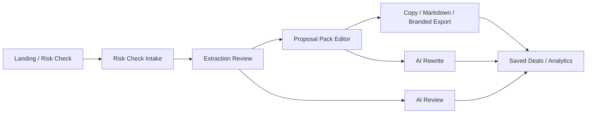

# Architecture

> ScopeOS current-state map

## Overview
ScopeOS is a Next.js App Router application in TypeScript with Tailwind-based UI, first-party auth/session handling, MongoDB-backed workspace storage, Stripe billing, and structured AI generation for extraction review and proposal-pack rewriting.

The app is intentionally narrow:
- intake a messy website brief
- review scope and risks
- generate a proposal pack
- save history and exports
- let founders revise and reuse the work

## Core Flow

## Main Components

### App routes
- `src/app/page.tsx` — marketing landing page and launch entrypoint
- `src/app/risk-check/page.tsx` — intake page for new briefs
- `src/app/extraction-review/[id]/page.tsx` — internal scope review step
- `src/app/proposal-pack/[id]/page.tsx` — editable proposal pack workspace
- `src/app/deals/page.tsx` — saved deal history and reopen flow
- `src/app/analytics/page.tsx` — usage / feedback dashboard
- `src/app/account/page.tsx` — plan and billing control surface

### Core libraries
- `src/lib/risk-check-*` — intake schema, storage, analysis, and presenters
- `src/lib/extraction-review-*` — internal review logic, storage, and AI helper
- `src/lib/proposal-pack-*` — proposal generation, storage, and AI helper
- `src/lib/ai-provider.ts` — provider resolution, response parsing, and friendly labels
- `src/lib/analytics-storage.ts` — event storage and summary logic
- `src/lib/workspace-billing.ts` — workspace records, plan state, and billing sync
- `src/lib/auth/*` — first-party credential, session, and current-user helpers
- `src/lib/mongo.ts` — MongoDB client lifecycle and index bootstrap

### External services
| Service | Purpose |
| --- | --- |
| MongoDB + first-party auth/session layer | Authentication, sessions, and workspace-scoped persistence |
| Stripe | Checkout, billing portal, and subscription sync |
| NVIDIA OpenAI-compatible endpoint | AI generation for review and rewrite workflows |

## Data Flow
1. User submits a brief through the risk-check form.
2. The intake route validates the payload and stores the submission.
3. Deterministic analysis produces missing-info prompts and risk flags.
4. The extraction review page lets the founder edit the internal scope view.
5. The proposal-pack page generates client-facing copy, pricing tiers, and exclusions.
6. AI helpers can refine either stage, but manual review remains the control point.
7. Saved deals, analytics, and AI run history provide workspace recall.

## Conventions
- Server components own workspace-aware fetching.
- Client components own editing, autosave, and interaction-heavy UI.
- Storage is workspace-scoped and designed to survive refreshes.
- Authentication is app-owned: password hashes live in MongoDB and sessions are cookie-backed from the app itself.
- AI outputs are structured and explainable rather than free-form chat.
- Feature access is gated by plan where appropriate.

## Technical Debt / Next Cleanup
- Storage helper naming still uses some legacy `shouldUseNeon` compatibility wrappers and should be renamed to Mongo-neutral terminology in a cleanup pass.
- A few repo docs and historical logs still mention Neon and should be treated as stale historical context, not current architecture.
- Browser automation coverage is still thinner than it should be for GA confidence.
